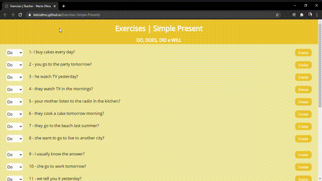
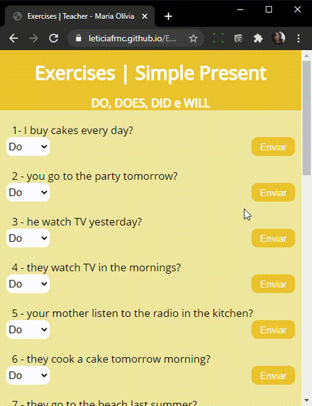

### A Landing Page foi criada para uma professora de inglês com o intuito de facilitar as atividades extras, assim economizando papel.

- Funciona em todos os tipos de telas.
- JavaScript foi utilizado para a validação do formlário.
- Css
- Html

### Instalação 

Clone este repositório usando git clone https://github.com/Leticiafrnc/Exercises-Simple-Present.git ou clique em Code/Download ZIP.
Clique no arquivo "index.HTML" e veja a aplicação.
### Observação: Se abrir a aplicação no celular, tablet ou qualquer tipo de tela a aplicação se adapta.
